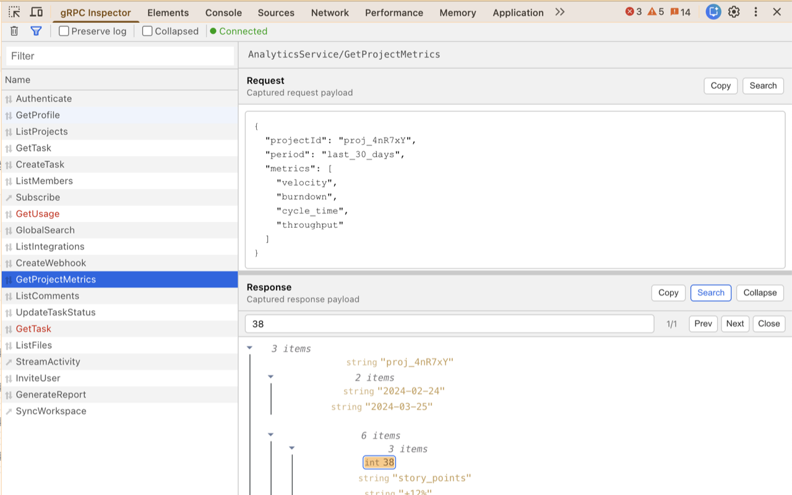
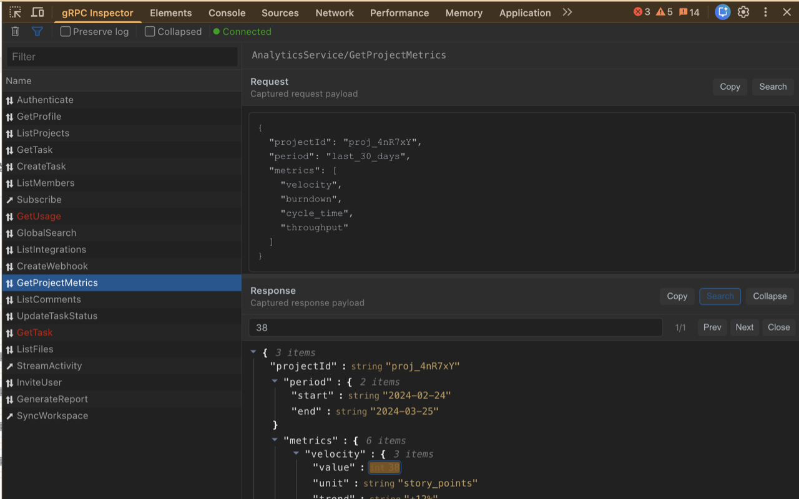

# gRPC-Web Dev Tools

[](http://makeapullrequest.com)



Now supports dark mode.

## Installation

### Chrome

The source build requires Chrome 111 or newer for declarative `MAIN` content
scripts. The browser loads the isolated bridge and then the page hooks at
document start; interceptor files are not web-accessible resources. Application
setup should check for an existing page API as well as listen for readiness,
as shown below.

Via
the [Chrome Web Store](https://chrome.google.com/webstore/detail/grpc-web-developer-tools/kanmilmfkjnoladbbamlclhccicldjaj) (
recommended)

or

1. build it with `make build`
1. open the **Extension Management** page by navigating to `chrome://extensions`.
1. enable **Developer Mode** by clicking the toggle switch next to "Developer mode".
1. Click the **LOAD UNPACKED** button and select the extension `./build` directory.

### Firefox

Via [Firefox Browser Add-Ons](https://addons.mozilla.org/en-US/firefox/addon/grpc-web-developer-tools/) (recommended)

or

1. build and package with `make package`
1. enter `about:debugging` in the URL bar of Firefox
1. click **This Firefox** > **Load Temporary Add-on...**
1. select the `grpc-web-devtools.zip` extention file

## Usage

```ts
const client = new EchoServiceClient('http://myapi.com');

const installDevTools = () => window.__GRPCWEB_DEVTOOLS__?.([client]);
installDevTools();
window.addEventListener('grpc-web-dev-tools-ready', installDevTools);
```

> NOTE: Requires that your generated client(s) use `protoc-gen-grpc-web` >= 1.0.4

Connect-ES and protobuf-ts use transport interceptors instead. See the
[web application setup guide](docs/client-integration.md) for standalone,
copyable JavaScript/TypeScript setup, replay adapters, feature limits, and
troubleshooting.

LLM coding agents can use the executable
[`grpc-web-client-integration` skill](skills/grpc-web-client-integration/SKILL.md)
to audit an existing client without changing it, identify exact missing source
signals, and apply only the minimal authorized integration changes when needed.
The package-scoped inspector also reports `file:line` evidence, nested-package
boundaries, SSR risks, legacy Connect usage, and relevant validation commands.

### Inspect, edit, and replay a captured request

1. Perform the gRPC-Web or Connect-Web call you want to inspect.
2. Select its entry in the DevTools panel.
3. In the **Request** pane, choose **Edit**.
4. Change the captured JSON, then choose **Send request**.

The replay is sent through the originating frame and appears as a new request
entry. The panel labels it as a retry of the original request. Its list and
details views show the exact **Frame URL**, start time, completion time,
duration, and time-to-first-message (TTFM) for streams.

Connect-Web and protobuf-ts request capture includes default-valued scalar
fields, so values such as `{ "countryCode": "" }` remain visible instead of
appearing as `{}`. This represents the complete protobuf message value. With
ordinary proto3 implicit presence, an empty string can still be omitted from the
binary wire format; use an `optional` field or a wrapper type when the server
must distinguish "unset" from "set to empty".

> **Warning:** Replay sends a real backend request. It may reuse the captured
> request's authentication and metadata. An acknowledgement only means the
> page accepted and scheduled the replay; the new request entry records the
> actual RPC success or failure.

### Language and debug reports

The panel supports English and Korean. It follows the browser UI language by
default; use the settings gear in the panel toolbar to choose **Auto
(browser)**, **English**, or **한국어**. Korean copy keeps standard developer
terms such as `Request`, `Response`, `Replay`, `JSON`, `Metadata`, and URL labels
in English so they remain consistent with code, logs, and issue trackers.

Select a captured request and use **Copy report** beside its RPC method. The
main split-button action copies a Markdown report suitable for sharing in an
issue. Open its caret menu to choose Markdown or JSON explicitly. Both formats
contain only the request URL (including the RPC method), captured request, and
captured response. Retained stream messages and captured errors are included
inside the response.

Reports never include the internal replay capability token. They do preserve
captured URLs, query values, and payloads exactly and do **not** redact secrets
or personal data. Review a report before sharing it outside your team. Raw
request and response copy buttons remain available when only the payload is
needed.

#### Downloadable audit reports

After reproducing a problem, choose **Audit report** in the panel toolbar to
download one paste-ready Markdown file. The report combines recent detected
issues with recent requests matching the active Filter, so QA can hand off a
reproduction without copying each Request and Response separately. Network and
RPC errors are prioritized, and the report also flags slow or incomplete calls,
partial stream failures, failed replays, dropped stream history, large payloads,
and capture truncation.

The filename includes the inspected host, URL path and query parameter names,
followed by UTC time and a sequence number. For example,
`grpc-audit-app-example-test-orders-123-token-2026-08-26T09-14-32-184Z-1.md`.
URL credentials, query values and fragments are omitted, but paths and parameter
names can still contain sensitive information. Review the filename as well as
the report before sharing it.

Report prose follows the extension's selected language. Captured evidence such
as URLs, RPC methods and codes, backend messages, JSON, and the filename stays
unchanged. The scope uses an ISO-8601 **Reviewed activity window (UTC)** from
the earliest reviewed Request start to the latest reviewed completion, plus its
duration. A single instant or missing timing is shown once instead of as a
duplicated range.

Each file contains a chronological activity timeline, detailed evidence for up
to 25 requests, repeated-failure and shared-route observations, request timing,
network-failure classification, gRPC status, retained Request/Response snapshots,
and explicit markers when evidence was truncated or evicted. Suggested
investigation areas are based on captured status codes and patterns; they are
clues, not root-cause determinations. Correlate the timestamps and request IDs
with backend and proxy logs. The browser capture does not include server logs,
response headers, trailers, or stack traces.

Audit exports scan at most 1,000 lightweight summaries and include a 50-request
metadata timeline. They preserve the full redacted payloads retained for the
selected requests; there is no additional per-payload or total report byte cap.
Exporting does not create a second history store. The inspector payload cache is capped at 500 entries and
32 MiB in aggregate, with a 5 MiB per-request limit and 100 retained stream
messages. A disconnected frame's forwarding queue is capped at 100 events and
8 MiB.

Unlike the raw single-request report above, audit reports apply best-effort
redaction for common credential fields, token-shaped text, URL credentials,
query values, and fragments. The active Filter text and internal replay token
are omitted. Structural redaction cannot identify every secret or personal data
field, so review the downloaded file before sharing it outside your team.

### Page trust and security

The transport hooks run in the inspected page's JavaScript environment. Scripts
in that page can observe or replace the hooks, forge captured diagnostics, and
invoke page-visible replay handles. Replay tokens correlate retained requests;
they do not authenticate the DevTools user to the page. Treat captured content
as untrusted, and enable application instrumentation only in environments where
you intend to expose request data and replay to page scripts. The extension's
isolated bridge and service worker must continue to enforce message validation
and routing to the originating tab and frame.

### Replay limits and request construction

Replay is available only for a request the extension has already captured. The
originating frame and its instrumented client/interceptor must still be alive.
Page-side replay handles do not expire based on elapsed time and are bounded to
the 100 most recently used handles per transport. The full request body must
still be retained in the panel's payload cache, must not be truncated, and the
edited JSON object must be 5 MiB or smaller.

Arbitrary, uncaptured RPC composition is not supported. Supporting that safely
requires a future application-provided invocation/catalog adapter; this release
only reconstructs captured requests.

For gRPC-Web, replay first uses an optional per-method adapter. Without one, it
clones the original generated request and applies generated protobuf setters for
supported scalar, enum, bytes, repeated, and inferable nested fields. It rejects
fields whose type cannot be safely inferred rather than guessing. Register an
adapter when your request needs custom reconstruction:

```javascript
window.__GRPCWEB_DEVTOOLS__.registerMethod('/example.EchoService/Send', {
  fromJson(json, originalRequest) {
    return SendRequest.fromJson(json);
  },
});

// Remove the adapter when the application no longer needs it.
window.__GRPCWEB_DEVTOOLS__.unregisterMethod('/example.EchoService/Send');
```

An adapter may provide `createRequest(json, originalRequest)` instead of
`fromJson`. Connect-Web replay uses the captured message type's generated JSON
constructors (`fromJson`/`fromJsonString`) where available, before trying safe
constructor or instance fallbacks.

## Example

The example uses `docker-compose` to start a simple gRPC server, JavaScript client and the Envoy proxy for gRPC-Web:

```bash
make example-up
```

Example will be running on [http://localhost:8080](http://localhost:8080)

To stop the example:

```bash
make example-down
```

## Publishing to the Chrome Web Store

1. Bump the version in `public/manifest.json` and `package.json` to the same value.
2. Build:
   ```bash
   npm run build
   ```
3. Create the zip **from inside** the `build/` directory so `manifest.json` sits at the root (not inside a `build/` folder):
   ```bash
   cd build && zip -r ../grpc-web-inspector-<version>.zip . && cd ..
   ```
4. Test the zip before uploading:
   ```bash
   rm -rf ~/Desktop/ext-test && mkdir ~/Desktop/ext-test
   cd ~/Desktop/ext-test && unzip ~/path/to/grpc-web-inspector-<version>.zip
   ```
   Then in Chrome go to `chrome://extensions` → **Developer mode** → **Load unpacked** → select `~/Desktop/ext-test`. Open DevTools on any page and verify the panel renders correctly.
5. Upload the zip at the [Chrome Developer Dashboard](https://chrome.google.com/webstore/devconsole) → your listing → **Package** → **Upload new package**.

## Connect-ES

grpc-web-devtools supports both the gRPC-Web and Connect protocols through
[`@connectrpc/connect-web`](https://connectrpc.com/docs/web/getting-started/).
Use a late-bound wrapper so the transport also works when it is created before
the extension injects its page API:

```ts
const devtoolsInterceptor: Interceptor = (next) => (request) => {
  const devtools = window.__CONNECT_WEB_DEVTOOLS__;
  return devtools ? devtools(next)(request) : next(request);
};

const transport = createGrpcWebTransport({
  baseUrl: 'https://api.example.com',
  interceptors: [devtoolsInterceptor, authInterceptor],
});
```

The same wrapper works with `createConnectTransport()`. protobuf-ts is also
supported for unary and server-streaming calls; its setup is in the
[client integration guide](docs/client-integration.md#protobuf-ts).
